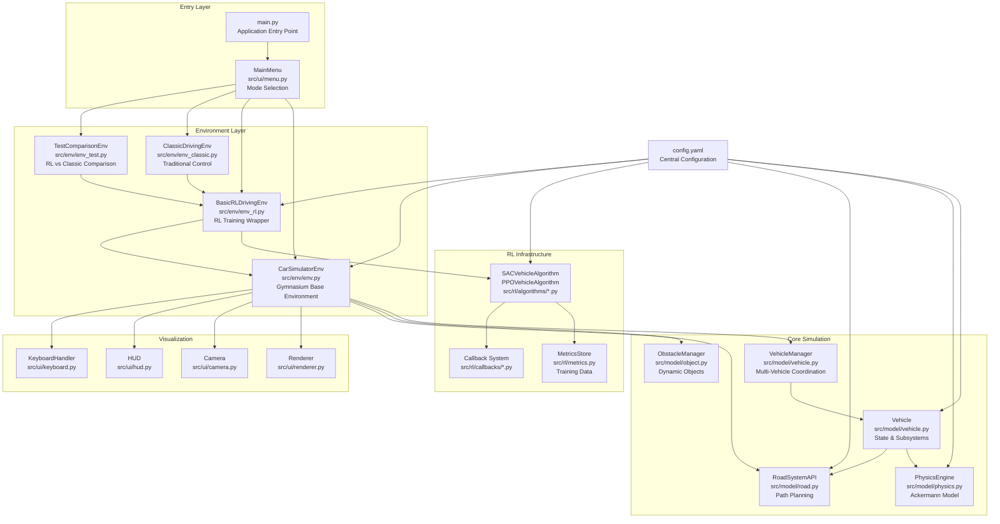
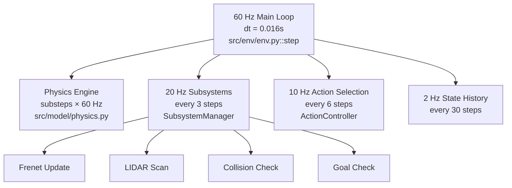
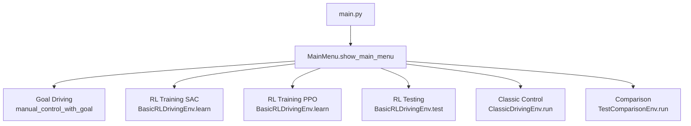
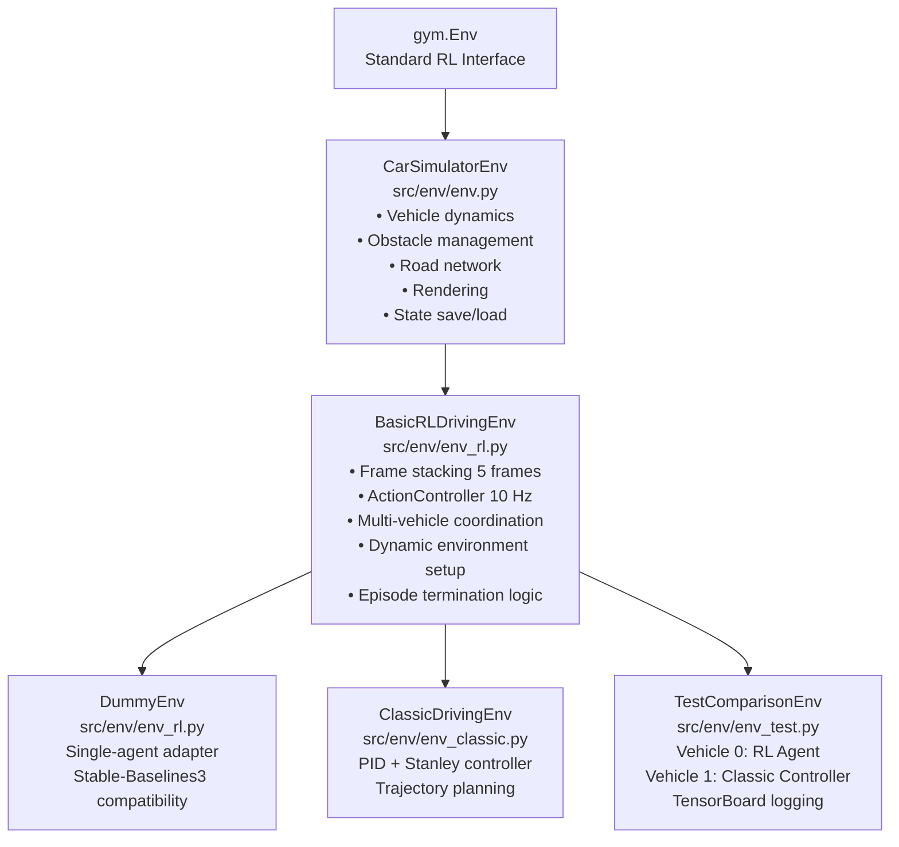
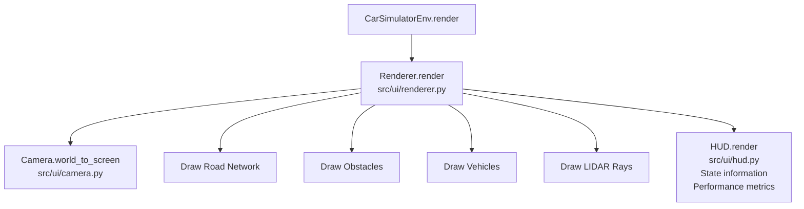

# 2D Top-Down Car Simulation

## Setup

### Install uv

>공식 설치 문서: <https://docs.astral.sh/uv/getting-started/installation/#standalone-installer>

- 윈도우 (PowerShell)

```PowerShell
powershell -ExecutionPolicy ByPass -c "irm https://astral.sh/uv/install.ps1 | iex"
```

- macOS / Linux (bash)

```bash
curl -LsSf https://astral.sh/uv/install.sh | sh
```

- 설치 확인

```shell
uv --version
```

### Usage

```shell
uv run main.py
```

## Overview

> **Relevant source files**
> * [config/config.yaml](https://github.com/2024-RL-Control/car_sim/blob/a8670ab1/config/config.yaml)
> * [main.py](https://github.com/2024-RL-Control/car_sim/blob/a8670ab1/main.py)
> * [src/env/env.py](https://github.com/2024-RL-Control/car_sim/blob/a8670ab1/src/env/env.py)
> * [src/ui/menu.py](https://github.com/2024-RL-Control/car_sim/blob/a8670ab1/src/ui/menu.py)

### Purpose and Scope

The `car_sim` repository is a 2D top-down vehicle simulator designed for reinforcement learning (RL) research on autonomous driving control. The system provides a physics-based simulation environment implementing the Gymnasium interface, enabling training and evaluation of deep RL agents for vehicle control tasks such as goal-reaching, obstacle avoidance, and lane-keeping. The simulator supports both learning-based (SAC, PPO) and traditional (PID, Stanley) control methods, facilitating comparative analysis of different approaches.

This document provides a high-level architectural overview of the entire system. For detailed information on specific subsystems:

* Configuration parameters: see [Configuration System](/2024-RL-Control/car_sim/2.1-configuration-system)
* RL training procedures: see [Reinforcement Learning](/2024-RL-Control/car_sim/5-reinforcement-learning)
* Physics and vehicle dynamics: see [Physics Engine](/2024-RL-Control/car_sim/3.2-physics-engine)
* Path planning algorithms: see [Road Network and Path Planning](/2024-RL-Control/car_sim/3.3-road-network-and-path-planning)

**Sources**: [config/config.yaml L1-L226](https://github.com/2024-RL-Control/car_sim/blob/a8670ab1/config/config.yaml#L1-L226)

 [main.py L1-L66](https://github.com/2024-RL-Control/car_sim/blob/a8670ab1/main.py#L1-L66)

 [src/env/env.py L1-L538](https://github.com/2024-RL-Control/car_sim/blob/a8670ab1/src/env/env.py#L1-L538)

---

### System Architecture

The system follows a layered architecture organized around five major subsystems: entry points, environment implementations, core simulation engine, RL training infrastructure, and visualization components. A central configuration system (`config.yaml`) parameterizes all components, enabling reproducible experiments without code modifications.

#### Architecture Diagram



**Sources**: [main.py L1-L66](https://github.com/2024-RL-Control/car_sim/blob/a8670ab1/main.py#L1-L66)

 [src/env/env.py L23-L538](https://github.com/2024-RL-Control/car_sim/blob/a8670ab1/src/env/env.py#L23-L538)

 [src/ui/menu.py L4-L92](https://github.com/2024-RL-Control/car_sim/blob/a8670ab1/src/ui/menu.py#L4-L92)

---

### Key Features

#### Physics Simulation

The system implements a sophisticated vehicle dynamics model based on the Ackermann steering geometry and bicycle model kinematics. The `PhysicsEngine` class [src/model/physics.py](https://github.com/2024-RL-Control/car_sim/blob/a8670ab1/src/model/physics.py)

 performs three-stage computation each simulation step:

1. **Input Processing**: Throttle/steering response with speed-dependent factors
2. **Force Calculation**: Blended acceleration, rolling resistance, aerodynamic drag, lateral dynamics using Pacejka Magic Formula
3. **State Integration**: Velocity and position updates with substep refinement

Key parameters from configuration:

| Parameter | Value | Description |
| --- | --- | --- |
| `substeps` | 1-5 | Physics integration substeps per frame |
| `dt` | 0.016s | Simulation timestep (60 Hz) |
| `drag_coeff` | 0.30 | Aerodynamic drag coefficient |
| `roll_resist` | 0.015 | Rolling resistance coefficient |
| `throttle_response_rate` | 15.0 1/s | Throttle response rate |
| `steering_response_rate` | 8.0 1/s | Steering response rate |

**Sources**: [config/config.yaml L176-L209](https://github.com/2024-RL-Control/car_sim/blob/a8670ab1/config/config.yaml#L176-L209)

 [src/model/physics.py](https://github.com/2024-RL-Control/car_sim/blob/a8670ab1/src/model/physics.py)

#### Multi-Vehicle Support

The `VehicleManager` class [src/model/vehicle.py](https://github.com/2024-RL-Control/car_sim/blob/a8670ab1/src/model/vehicle.py)

 orchestrates multiple vehicles simultaneously, tracking collision status, goal achievement, and road violations. The system supports up to N vehicles (configured via `simulation.num_vehicles`), each with independent:

* State tracking (`VehicleState` dataclass)
* Sensor systems (`SensorManager`)
* Goal queues
* Subsystem update schedules (`SubsystemManager`)

**Sources**: [src/env/env.py L52-L74](https://github.com/2024-RL-Control/car_sim/blob/a8670ab1/src/env/env.py#L52-L74)

 [config/config.yaml L7](https://github.com/2024-RL-Control/car_sim/blob/a8670ab1/config/config.yaml#L7-L7)

#### Observation Space

Each vehicle's observation vector combines three data sources:

| Component | Dimensions | Range | Description |
| --- | --- | --- | --- |
| Vehicle State | 19 | [-1, 1] | Progress, throttle, brake, steering, velocities, accelerations, Frenet coordinates, target errors |
| LIDAR | 15 | [0, 1] | Normalized distance measurements from -170° to +170° |
| Trajectory | 0 (disabled) | N/A | Future trajectory prediction (currently unused) |

Total observation dimension: **34** (19 + 15 + 0). With frame stacking of 5 frames, the final observation is **170-dimensional**.

**Sources**: [src/env/env.py L390-L459](https://github.com/2024-RL-Control/car_sim/blob/a8670ab1/src/env/env.py#L390-L459)

 [config/config.yaml L40-L43](https://github.com/2024-RL-Control/car_sim/blob/a8670ab1/config/config.yaml#L40-L43)

#### Action Space

The continuous action space is 2-dimensional:

```
action_space = Box(low=[-1.0, -1.0], high=[1.0, 1.0], dtype=float32)
```

* **Action[0]**: Throttle/Brake control [-1, 1] * Positive values → acceleration * Negative values → braking
* **Action[1]**: Steering [-1, 1] * Mapped to ±35° physical steering angle

**Sources**: [src/env/env.py L93-L98](https://github.com/2024-RL-Control/car_sim/blob/a8670ab1/src/env/env.py#L93-L98)

#### Path Planning

The `RoadSystemAPI` provides three path planning modes:

1. **Straight**: Direct linear connection
2. **Curve (Bézier)**: Smooth curved paths using cubic Bézier curves
3. **Plan (RRT + Dubins)**: Rapidly-exploring Random Tree with Dubins curves for obstacle avoidance

The RRT planner uses:

* KD-Tree for efficient nearest neighbor search (k=10)
* Adaptive step sizing based on obstacle proximity
* Curvature-based speed recommendations (max lateral acceleration: 4.0 m/s²)

**Sources**: [config/config.yaml L72-L90](https://github.com/2024-RL-Control/car_sim/blob/a8670ab1/config/config.yaml#L72-L90)

 [src/model/road.py](https://github.com/2024-RL-Control/car_sim/blob/a8670ab1/src/model/road.py)

---

### Multi-Rate Simulation Architecture

The simulator employs a multi-rate update strategy to balance computational efficiency with responsiveness. A 60 Hz main loop serves as the temporal foundation, with subsystems updating at frequencies tuned to their requirements:

#### Update Frequency Table

| Subsystem | Frequency | Update Interval | Purpose |
| --- | --- | --- | --- |
| Main Loop | 60 Hz | Every step (16.67ms) | Physics integration, rendering |
| Physics Substeps | 60-300 Hz | Configurable | Numerical stability |
| Frenet Coordinates | 20 Hz | Every 3 steps (50ms) | Road position tracking |
| LIDAR Scan | 20 Hz | Every 3 steps (50ms) | Obstacle sensing |
| Collision Check | 20 Hz | Every 3 steps (50ms) | Safety monitoring |
| Goal Check | 20 Hz | Every 3 steps (50ms) | Target achievement |
| RL Action Selection | 10 Hz | Every 6 steps (100ms) | Policy network inference |
| State History | 2 Hz | Every 30 steps (500ms) | Trajectory logging |
| Trajectory Prediction | 0 Hz | Disabled | Future path estimation |

#### Timing Diagram



The `action_hold_behavior: true` configuration ensures that RL actions persist between selection events, reducing action jitter and improving sample efficiency. This design decouples decision-making frequency from simulation fidelity.

**Sources**: [config/config.yaml L22-L36](https://github.com/2024-RL-Control/car_sim/blob/a8670ab1/config/config.yaml#L22-L36)

 [src/env/env.py L210-L272](https://github.com/2024-RL-Control/car_sim/blob/a8670ab1/src/env/env.py#L210-L272)

---

### Entry Points and Operational Modes

The system provides six operational modes accessible through the `MainMenu` interface:

#### Mode Overview



#### Mode Details

| Mode | Entry Function | Environment | Purpose |
| --- | --- | --- | --- |
| Goal Driving | `manual_control_with_goal()` | `CarSimulatorEnv` | Manual keyboard control with goal waypoints |
| RL Training (SAC) | `BasicRLDrivingEnv.learn(algorithm='sac')` | `BasicRLDrivingEnv` | Train Soft Actor-Critic agent |
| RL Training (PPO) | `BasicRLDrivingEnv.learn(algorithm='ppo')` | `BasicRLDrivingEnv` | Train Proximal Policy Optimization agent |
| RL Testing | `BasicRLDrivingEnv.test()` | `BasicRLDrivingEnv` | Evaluate trained RL agent |
| Classic Control | `ClassicDrivingEnv.run()` | `ClassicDrivingEnv` | Test PID + Stanley controller |
| Comparison | `TestComparisonEnv.run()` | `TestComparisonEnv` | Compare RL vs Classic side-by-side |

**Sources**: [main.py L16-L66](https://github.com/2024-RL-Control/car_sim/blob/a8670ab1/main.py#L16-L66)

 [src/ui/menu.py L19-L91](https://github.com/2024-RL-Control/car_sim/blob/a8670ab1/src/ui/menu.py#L19-L91)

---

### Environment Hierarchy

The environment system follows a wrapper pattern, building from a Gymnasium-compatible base to specialized RL and testing environments:



#### Wrapper Responsibilities

* **`CarSimulatorEnv`**: Provides core physics simulation, rendering, and Gymnasium interface compliance [src/env/env.py L23-L538](https://github.com/2024-RL-Control/car_sim/blob/a8670ab1/src/env/env.py#L23-L538)
* **`BasicRLDrivingEnv`**: Adds RL-specific features including frame stacking, action frequency control, dynamic environment randomization, and episode management [src/env/env_rl.py](https://github.com/2024-RL-Control/car_sim/blob/a8670ab1/src/env/env_rl.py)
* **`DummyEnv`**: Adapter for single-agent Stable-Baselines3 algorithms, extracting vehicle 0's observation/reward from multi-agent outputs
* **`ClassicDrivingEnv`**: Implements traditional control methods for baseline comparison
* **`TestComparisonEnv`**: Coordinates simultaneous execution of RL and classic controllers for comparative evaluation

**Sources**: [src/env/env.py L23-L538](https://github.com/2024-RL-Control/car_sim/blob/a8670ab1/src/env/env.py#L23-L538)

 [src/env/env_rl.py](https://github.com/2024-RL-Control/car_sim/blob/a8670ab1/src/env/env_rl.py)

 [src/env/env_classic.py](https://github.com/2024-RL-Control/car_sim/blob/a8670ab1/src/env/env_classic.py)

 [src/env/env_test.py](https://github.com/2024-RL-Control/car_sim/blob/a8670ab1/src/env/env_test.py)

---

### Configuration System

The `config.yaml` file serves as the central parameter repository, organized into seven domains:

#### Configuration Domains

| Domain | Key Parameters | Consumer Systems |
| --- | --- | --- |
| `simulation` | fps, dt, num_vehicles, boundary, hz settings | `CarSimulatorEnv`, `VehicleManager` |
| `visualization` | window_size, camera_zoom, training_mode, debug_mode | `Renderer`, `Camera`, `HUD` |
| `vehicle` | Tesla Model 3 specs (mass, dimensions, wheelbase), sensors | `Vehicle`, `PhysicsEngine`, `SensorManager` |
| `physics` | substeps, drag_coeff, roll_resist, Pacejka coefficients | `PhysicsEngine` |
| `simulation.rl` | train_max_steps, action_selection_hz, frame_stack_size, rewards | `BasicRLDrivingEnv`, `SACVehicleAlgorithm`, `PPOVehicleAlgorithm` |
| `simulation.path_planning` | RRT parameters, Dubins curves, road_width, speed limits | `RoadSystemAPI`, `PathPlanner` |
| `classic` | PID gains, Stanley parameters, trajectory costs | `ClassicController` |

#### Key Configuration Values

```yaml
# Core Simulation Timing
simulation:
  fps: 60
  dt: 0.016
  hz:
    frenet_update: 20
    lidar_update: 20
    collision_check: 20
    action_selection_hz: 10

# Vehicle Model (Tesla Model 3)
vehicle:
  length: 4.72        # m
  wheelbase: 2.875    # m
  mass: 1830.0        # kg
  max_steer: 35.0     # degrees

# RL Training
simulation.rl:
  frame_stack_size: 5
  action_selection_hz: 10
  rewards:
    success: 100
    collision: -300
    outside: -200
```

For comprehensive configuration documentation, see [Configuration System](/2024-RL-Control/car_sim/2.1-configuration-system).

**Sources**: [config/config.yaml L1-L226](https://github.com/2024-RL-Control/car_sim/blob/a8670ab1/config/config.yaml#L1-L226)

---

### Visualization and Rendering

The visualization system uses Pygame to provide real-time feedback during simulation and training. The system is configurable for both headless training (`training_mode: true`) and visual debugging:

#### Rendering Pipeline



The `Renderer` class maintains performance metrics (FPS, physics time) and supports debug visualization modes. The `Camera` class provides viewport management with zoom and pan capabilities. The `HUD` overlays state information including vehicle velocities, progress, and system performance.

For detailed rendering system documentation, see [Visualization and User Interface](/2024-RL-Control/car_sim/6-visualization-and-user-interface).

**Sources**: [src/ui/renderer.py](https://github.com/2024-RL-Control/car_sim/blob/a8670ab1/src/ui/renderer.py)

 [src/ui/camera.py](https://github.com/2024-RL-Control/car_sim/blob/a8670ab1/src/ui/camera.py)

 [src/ui/hud.py](https://github.com/2024-RL-Control/car_sim/blob/a8670ab1/src/ui/hud.py)

 [config/config.yaml L104-L133](https://github.com/2024-RL-Control/car_sim/blob/a8670ab1/config/config.yaml#L104-L133)

---

### File Organization

The repository follows a modular structure:

```markdown
car_sim/
├── config/
│   └── config.yaml              # Central configuration
├── src/
│   ├── env/
│   │   ├── env.py              # CarSimulatorEnv (base)
│   │   ├── env_rl.py           # BasicRLDrivingEnv (RL wrapper)
│   │   ├── env_classic.py      # ClassicDrivingEnv
│   │   └── env_test.py         # TestComparisonEnv
│   ├── model/
│   │   ├── vehicle.py          # Vehicle, VehicleManager, SubsystemManager
│   │   ├── physics.py          # PhysicsEngine
│   │   ├── road.py             # RoadSystemAPI, PathPlanner
│   │   ├── object.py           # ObstacleManager
│   │   └── sensor.py           # SensorManager, LidarSensor
│   ├── rl/
│   │   ├── algorithms/         # SACVehicleAlgorithm, PPOVehicleAlgorithm
│   │   ├── callbacks/          # Training callbacks
│   │   ├── metrics.py          # MetricsStore
│   │   └── features.py         # CustomFeatureExtractor
│   ├── ui/
│   │   ├── menu.py             # MainMenu
│   │   ├── renderer.py         # Renderer
│   │   ├── camera.py           # Camera
│   │   ├── hud.py              # HUD
│   │   └── keyboard.py         # KeyboardHandler
│   ├── utils/
│   │   └── config_utils.py     # Configuration loading
│   └── examples/
│       └── env_examples.py     # Example usage
└── main.py                      # Application entry point
```

Each subsystem is isolated into its own module, enabling independent development and testing. The separation of concerns allows the physics engine to be used independently of RL training, and the rendering system to be disabled for faster training.

**Sources**: [main.py L1-L66](https://github.com/2024-RL-Control/car_sim/blob/a8670ab1/main.py#L1-L66)

 [src/env/env.py L1-L538](https://github.com/2024-RL-Control/car_sim/blob/a8670ab1/src/env/env.py#L1-L538)
